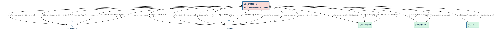
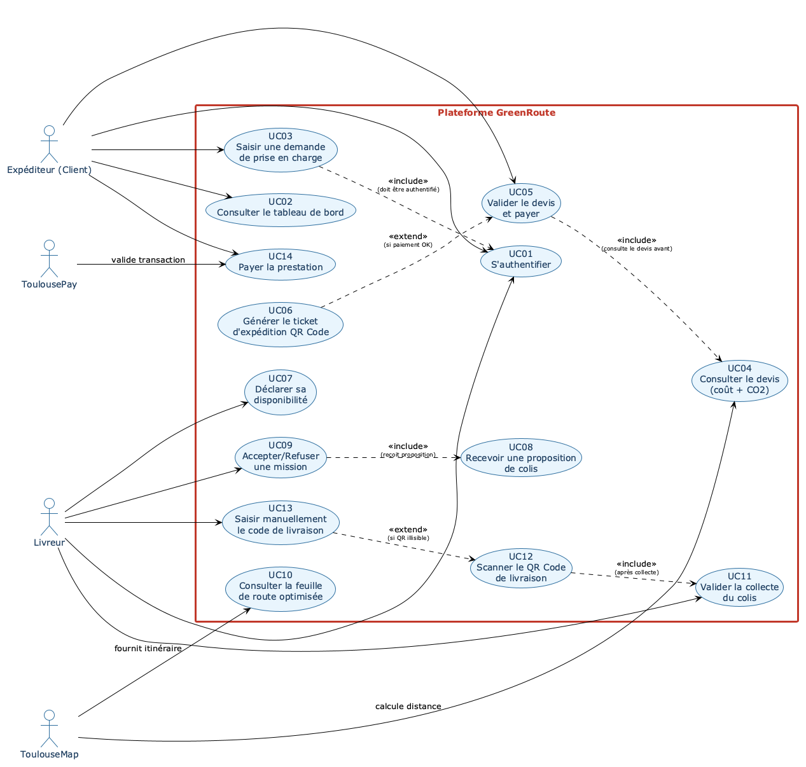
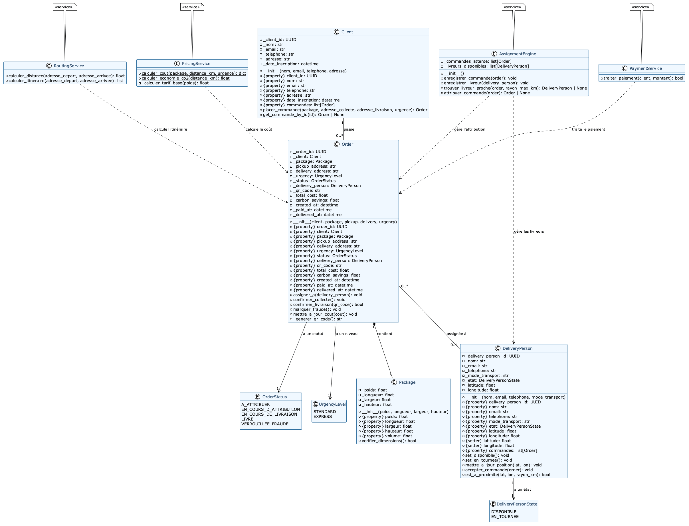
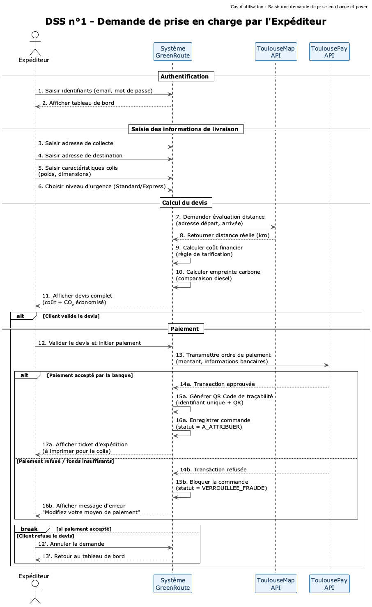
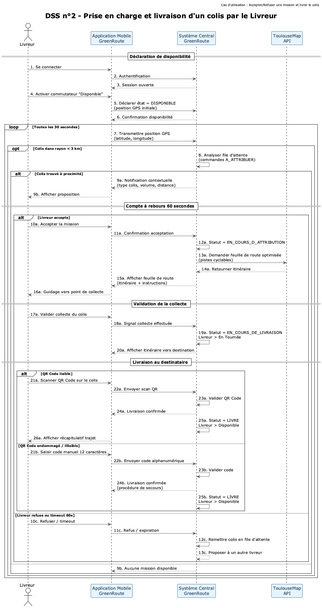

# DOSSIER D'ANALYSE FONCTIONNELLE (DAF)

## GreenRoute — Plateforme de livraison éco-responsable du dernier kilomètre

---

**Cours :** ESGI — Modélisation UML2  
**Année scolaire :** 2025–2026  
**Projet :** Examen final avec soutenance orale  
**Date de remise :** 09 juillet 2026  

---

## Table des matières

1. Glossaire métier  
2. Diagramme de contexte  
3. Diagramme de cas d'utilisation  
4. Descriptions textuelles détaillées des cas d'utilisation  
5. Diagramme de classes d'analyse  
6. Diagrammes de séquence système (DSS)  
7. Maquettes d'IHM  
8. Code source du modèle (Python)  
9. Critères Bastien & Scapin — Argumentation  

---

## 1. Glossaire métier

| Terme | Définition |
|---|---|
| **Expéditeur** | Client (boutique, e-commerçant, particulier) qui soumet une demande de livraison de marchandise via la plateforme web GreenRoute. |
| **Livreur** | Prestataire indépendant utilisant un mode de transport doux (vélo-cargo, triporteur, camionnette électrique) pour effectuer les livraisons. |
| **Colis** | Unité logistique transportée, caractérisée par son poids (kg) et ses dimensions (L × l × h en cm). |
| **Commande** | Transaction complète initiée par un expéditeur, contenant un colis, un itinéraire, un niveau d'urgence et un statut de suivi. |
| **Devis** | Estimation financière et écologique fournie avant validation de la commande, incluant le coût total et l'empreinte carbone économisée. |
| **QR Code de traçabilité** | Code unique généré automatiquement après paiement, permettant au livreur de valider la livraison par scan. |
| **Ticket d'expédition** | Document imprimable contenant l'identifiant unique et le QR Code, à apposer sur le colis. |
| **ToulouseMap** | API cartographique externe utilisée pour le calcul de distances, d'itinéraires et l'estimation des temps de trajet. |
| **ToulousePay** | Passerelle de paiement bancaire externe sécurisée, validant ou rejetant les transactions financières. |
| **Moteur d'attribution** | Composant logiciel qui analyse la position des livreurs disponibles et leur assigne les commandes en attente dans un rayon de 3 km. |
| **Dernier kilomètre** | Segment final de la chaîne logistique, de la plateforme de distribution au destinataire final. |
| **Empreinte carbone économisée** | Différence calculée entre les émissions de CO₂ d'un véhicule diesel standard et celles d'un mode de transport doux pour un trajet équivalent. |

---

## 2. Diagramme de contexte

Le diagramme de contexte ci-dessous délimite les frontières du système GreenRoute et identifie les acteurs humains (Expéditeur, Livreur) ainsi que les systèmes externes (ToulouseMap, ToulousePay, Banque) avec lesquels le système interagit.

```
Fichier : diagrams/contexte.puml
```



### Acteurs et systèmes externes

| Acteur / Système | Type | Description des flux |
|---|---|---|
| **Expéditeur** | Acteur humain | S'authentifie, saisit les informations de livraison, valide le devis, paie, imprime le ticket d'expédition. |
| **Livreur** | Acteur humain | S'authentifie, déclare sa disponibilité, transmet sa position GPS, reçoit des notifications de colis, scanne le QR Code. |
| **ToulouseMap** | Système externe | Calcule les distances et temps de trajet, génère des feuilles de route optimisées (pistes cyclables). |
| **ToulousePay** | Système externe | Traite les transactions de paiement et retourne l'acceptation ou le rejet. |
| **Banque** | Système externe | Valide ou refuse les transactions financières en fond. |

---

## 3. Diagramme de cas d'utilisation

```
Fichier : diagrams/usecase.puml
```



### Relations d'inclusion (<< include >>)

| Cas source | Cas inclus | Justification |
|---|---|---|
| **Saisir une demande de prise en charge** (UC03) | **S'authentifier** (UC01) | L'expéditeur doit obligatoirement être authentifié avant de pouvoir soumettre une demande. L'inclusion est non conditionnelle. |
| **Valider le devis et payer** (UC05) | **Consulter le devis** (UC04) | Le client doit avoir consulté le devis financier et écologique avant de pouvoir valider le paiement. |
| **Accepter/Refuser une mission** (UC09) | **Recevoir une proposition de colis** (UC08) | Le livreur ne peut accepter ou refuser qu'après avoir reçu une notification de proposition. |
| **Scanner le QR Code de livraison** (UC12) | **Valider la collecte du colis** (UC11) | Le scan du QR Code de livraison s'effectue après que le livreur a validé la collecte du colis. |

### Relations d'extension (<< extend >>)

| Cas source | Cas étendu | Justification |
|---|---|---|
| **Saisir manuellement le code de livraison** (UC13) | **Scanner le QR Code de livraison** (UC12) | Alternative proposée lorsque le QR Code est physiquement endommagé ou illisible. L'extension est conditionnelle (déclenchée uniquement en cas d'échec du scan). |
| **Générer le ticket d'expédition QR Code** (UC06) | **Valider le devis et payer** (UC05) | La génération du ticket d'expédition n'a lieu qu'en cas de paiement réussi. C'est une extension du processus de validation de paiement. |

---

## 4. Descriptions textuelles détaillées des cas d'utilisation

### Cas d'utilisation n°1 : Saisir une demande de prise en charge et payer

| Champ | Description |
|---|---|
| **Identifiant** | UC03 + UC05 |
| **Acteurs** | Expéditeur (acteur principal), ToulouseMap (système externe), ToulousePay (système externe) |
| **Préconditions** | L'expéditeur est authentifié sur la plateforme web GreenRoute et consulte son tableau de bord. |
| **Postconditions (succès)** | La commande est enregistrée avec le statut **A_ATTRIBUER**, un ticket d'expédition avec QR Code est généré, le client peut l'imprimer. |
| **Postconditions (échec)** | La commande est créée avec le statut **VERROUILLEE_FRAUDE** et le client est invité à modifier son moyen de paiement. |

#### Scénario nominal

| Étape | Acteur | Action |
|---|---|---|
| 1 | Expéditeur | Saisit l'adresse physique complète de collecte (départ). |
| 2 | Expéditeur | Saisit l'adresse physique complète de destination (arrivée). |
| 3 | Expéditeur | Saisit les caractéristiques physiques du colis : poids (kg), longueur, largeur, hauteur (cm). |
| 4 | Expéditeur | Choisit le niveau d'urgence : **Standard** (24h) ou **Express** (2h). |
| 5 | Système | Envoie une requête à **ToulouseMap** pour évaluer la distance réelle du trajet. |
| 6 | ToulouseMap | Retourne la distance estimée (km) et la faisabilité du trajet. |
| 7 | Système | Calcule le **coût financier** selon la règle de tarification : tarif de base (indexé sur le poids) + coût kilométrique (0,50 €/km) + majoration Express de 30% si applicable. |
| 8 | Système | Calcule l'**empreinte carbone économisée** (différentiel diesel vs transport doux). |
| 9 | Système | Affiche le **devis complet** à l'expéditeur (coût financier + CO₂ économisé). |
| 10 | Expéditeur | **Valide le devis** et initie le paiement. |
| 11 | Système | Redirige vers le module de paiement sécurisé et transmet l'ordre à **ToulousePay**. |
| 12 | ToulousePay | **Accepte la transaction** bancaire. |
| 13 | Système | Enregistre la commande avec le statut **A_ATTRIBUER**. |
| 14 | Système | Génère un **QR Code de traçabilité** unique lié à la commande. |
| 15 | Système | Présente le **ticket d'expédition** imprimable à l'expéditeur. |

#### Scénarios alternatifs et d'exception

| Scénario | Déclencheur | Comportement |
|---|---|---|
| **Paiement refusé** | Étape 12 : ToulousePay rejette la transaction (fonds insuffisants, plafond dépassé, rejet banque). | Le système suspend immédiatement le processus. La commande est créée avec le statut **VERROUILLEE_FRAUDE**. Un message clair invite le client à modifier son moyen de paiement et à réessayer. |
| **Client annule** | Après affichage du devis (étape 9), le client refuse le devis. | Le système retourne au tableau de bord sans créer de commande. Aucune donnée persistante n'est conservée. |
| **Expiration de session** | Le client reste inactif pendant la saisie. | Le système déconnecte l'utilisateur pour des raisons de sécurité. Les données saisies sont perdues, l'utilisateur doit se réauthentifier. |

---

### Cas d'utilisation n°2 : Accepter une mission et livrer le colis

| Champ | Description |
|---|---|
| **Identifiant** | UC08 + UC09 + UC11 + UC12 |
| **Acteurs** | Livreur (acteur principal), ToulouseMap (système externe) |
| **Préconditions** | Le livreur est authentifié sur l'application mobile et a déclaré son état **Disponible**. Des commandes au statut **A_ATTRIBUER** existent dans la file d'attente. |
| **Postconditions (succès)** | La commande est livrée avec le statut **LIVRE**, le livreur repasse en statut **Disponible**, le récapitulatif du trajet est affiché. |
| **Postconditions (échec)** | Le colis reste dans la file d'attente et est proposé à un autre livreur. |

#### Scénario nominal

| Étape | Acteur | Action |
|---|---|---|
| 1 | Livreur | Se connecte à l'application mobile GreenRoute. |
| 2 | Livreur | Active le commutateur logique **Disponible** sur l'application. |
| 3 | Application mobile | Transmet la position GPS du livreur au système central (toutes les 30 secondes). |
| 4 | Système | Analyse la file d'attente des commandes au statut **A_ATTRIBUER**. |
| 5 | Système | Détecte un colis situé à moins de **3 km** de la position du livreur. |
| 6 | Système | Envoie une **notification contextuelle** à l'application mobile du livreur (type de colis, volume, distance). |
| 7 | Livreur | **Accepte la proposition** dans le délai de 60 secondes. |
| 8 | Système | Bascule le statut de la commande à **EN_COURS_D_ATTRIBUTION**. |
| 9 | Système | Interroge **ToulouseMap** pour générer une feuille de route optimisée (pistes cyclables). |
| 10 | ToulouseMap | Retourne le tracé de l'itinéraire. |
| 11 | Application | Affiche la feuille de route et guide le livreur vers le point de collecte. |
| 12 | Livreur | Se présente au point de collecte et récupère physiquement la marchandise. |
| 13 | Livreur | **Valide la collecte** sur l'application mobile. |
| 14 | Système | Bascule le statut à **EN_COURS_DE_LIVRAISON** et le livreur passe en état **En Tournée**. |
| 15 | Application | Affiche l'itinéraire en temps réel jusqu'au point de destination. |
| 16 | Livreur | Arrive à destination et **scanne le QR Code** sur le colis avec l'appareil photo. |
| 17 | Système | **Valide le QR Code** et bascule le statut à **LIVRE**. |
| 18 | Système | Repasse le livreur en statut **Disponible**. |
| 19 | Application | Affiche le **récapitulatif du trajet** au livreur. |

#### Scénarios alternatifs et d'exception

| Scénario | Déclencheur | Comportement |
|---|---|---|
| **Livreur refuse** | À l'étape 7, le livreur refuse la proposition. | Le système remet immédiatement le colis dans la file d'attente et le propose à un autre livreur à proximité. |
| **Timeout (60s)** | Le livreur n'agit pas dans les 60 secondes. | Le système considère la proposition comme expirée, le colis est proposé à un autre livreur. |
| **QR Code endommagé** | À l'étape 16, le QR Code est physiquement illisible (déchiré, sali). | L'application propose une **procédure de secours** : le livreur saisit manuellement le code alphanumérique unique à 12 caractères situé sous le QR Code. Si le code correspond, la livraison est validée. |
| **Perte de connexion au scan** | Le livreur n'a plus de réseau mobile au moment du scan final. | L'application stocke temporairement l'événement de livraison dans un **cache local chiffré** sur le smartphone. Dès le retour du réseau, la synchronisation s'effectue en tâche de fond pour mettre à jour le statut du colis sans bloquer l'activité du livreur. |

---

## 5. Diagramme de classes d'analyse

```
Fichier : diagrams/classe.puml
```



### Description des classes principales

#### Client
Classe représentant un expéditeur inscrit sur la plateforme. Attributs privés typés avec encapsulation stricte. Un client peut passer **plusieurs commandes** (relation 1 → 0..*).

#### Order
Classe centrale du modèle. Chaque commande contient **exactement un colis** (composition forte : le colis n'existe pas sans commande). Le statut évolue selon le cycle de vie : A_ATTRIBUER → EN_COURS_D_ATTRIBUTION → EN_COURS_DE_LIVRAISON → LIVRE (ou VERROUILLEE_FRAUDE en cas d'échec). Une commande peut être assignée à **zéro ou un livreur**.

#### Package
Représente les caractéristiques physiques du colis. Attributs typés (float) pour le poids et les dimensions. Méthode de vérification des limites de charge des vélos-cargos.

#### DeliveryPerson
Modélise un livreur indépendant. Son état (**Disponible** / **En Tournée**) détermine son éligibilité à recevoir des propositions. Sa position GPS (latitude/longitude) est mise à jour régulièrement pour le moteur d'attribution.

#### PricingService (Service)
Calcule le coût financier selon la règle métier : tarif de base au poids (5 €/kg jusqu'à 10 kg) + coût kilométrique (0,50 €/km) + majoration Express de 30%. Calcule également l'économie carbone par rapport à un véhicule diesel de référence (150 g CO₂/km).

#### AssignmentEngine (Service)
Moteur d'attribution central. Maintient une file des commandes en attente et l'annuaire des livreurs disponibles. Utilise la position GPS pour trouver le livreur le plus proche dans un rayon de 3 km.

### Cycle de vie des statuts de commande

```
A_ATTRIBUER
    → (Assignation par moteur) → EN_COURS_D_ATTRIBUTION
    → (Collecte validée) → EN_COURS_DE_LIVRAISON
    → (QR Code scanné) → LIVRE

A_ATTRIBUER / EN_COURS_D_ATTRIBUTION
    → (Échec paiement) → VERROUILLEE_FRAUDE
```

---

## 6. Diagrammes de séquence système (DSS)

### DSS n°1 — Demande de prise en charge par l'Expéditeur

Ce DSS couvre le processus complet depuis l'authentification jusqu'à la génération du ticket d'expédition, en passant par la saisie des informations, le calcul du devis, la validation et le paiement.

```
Fichier : diagrams/dss_expediteur.puml
```



#### Fragments combinés utilisés

| Fragment | Ligne | Usage |
|---|---|---|
| **loop** | Après authentification | Permet à l'expéditeur de recommencer la saisie en cas d'annulation de devis. Le client peut effectuer plusieurs tentatives. |
| **alt (paiement accepté/refusé)** | Après transmission à ToulousePay | Modélise la branche conditionnelle : la banque accepte ou refuse la transaction. Les deux issues sont représentées avec leurs postconditions respectives. |
| **break** | Si paiement accepté | Interrompt la boucle de saisie après un paiement réussi. Le processus est terminé. |
| **alt (client valide/refuse)** | Après affichage du devis | L'expéditeur peut valider le devis et poursuivre vers le paiement, ou refuser et retourner à la saisie. |

### DSS n°2 — Prise en charge et livraison d'un colis par le Livreur

Ce DSS modélise l'ensemble du parcours du livreur : connexion, déclaration de disponibilité, transmission GPS, réception de notification, acceptation, collecte, livraison et scan du QR Code.

```
Fichier : diagrams/dss_livreur.puml
```



#### Fragments combinés utilisés

| Fragment | Ligne | Usage |
|---|---|---|
| **loop (toutes les 30s)** | Transmission GPS | Boucle temporelle qui s'exécute tant que le livreur est disponible. La position GPS est envoyée à intervalles réguliers. |
| **opt (colis ≤ 3 km)** | Analyse file d'attente | Fragment optionnel : le système ne déclenche une notification que si un colis se trouve dans le rayon d'action. |
| **alt (accepter/refuser)** | Compte à rebours 60s | Branchement conditionnel : le livreur accepte (scénario nominal) ou refuse / laisse expirer le délai. |
| **alt (QR lisible / illisible)** | Scan final | Double branche : QR Code lisible (scan automatique) ou endommagé (saisie manuelle du code à 12 caractères). |

---

## 7. Maquettes d'IHM

### Maquette n°1 — Interface web expéditeur (demande de livraison)

```
Fichier : mockups/expediteur.html
```

**Ouvrir dans un navigateur pour visualiser la maquette interactive.**

#### Scénario nominal — Création d'une demande et paiement réussi

La maquette présente le formulaire de saisie des informations de livraison :
- Adresse de collecte et de destination
- Caractéristiques du colis (poids, dimensions)
- Sélecteur de niveau d'urgence (Standard/Express)
- **Devis calculé** affiché dynamiquement avec le coût total et l'empreinte carbone économisée

L'interface utilise un code couleur vert pour renforcer la dimension écologique de la marque.

#### Scénario d'exception — Échec de paiement

La maquette montre l'état d'erreur lorsque la transaction bancaire est rejetée :
- Encart d'alerte rouge avec icône d'avertissement
- Message explicite : "Paiement refusé — motif : fonds insuffisants, plafond dépassé ou blocage de sécurité"
- Indication du statut **VERROUILLEE_FRAUDE**
- Boutons d'action corrective : modifier le moyen de paiement, contacter le support

### Maquette n°2 — Interface mobile livreur (notification et scan QR Code)

```
Fichier : mockups/livreur.html
```

**Ouvrir dans un navigateur pour visualiser la maquette interactive.**

#### Scénario nominal — Notification de colis et scan QR Code

La maquette représente l'écran du smartphone du livreur :
- En-tête avec statut "Disponible" (indicateur vert)
- **Carte de notification** avec les détails du colis : type, volume, poids, distance
- **Compte à rebours** de 60 secondes pour accepter ou refuser
- Boutons d'action "Accepter" (vert) / "Refuser" (rouge)
- Section de **scan QR Code** avec animation de balayage
- QR Code à scanner (représentation visuelle)

#### Scénario d'exception — QR Code endommagé, saisie manuelle

La maquette montre l'écran alternatif lorsque le QR Code est illisible :
- Encart d'erreur : "QR Code illisible" sur fond rouge
- **Procédure de secours** : champ de saisie du code alphanumérique à 12 caractères
- Le code est pré-rempli pour la démonstration : **GR-7F3D-A2B9**
- Message d'aide : "Le code se trouve sous le graphique du QR Code"

---

## 8. Code source du modèle (Python)

### Structure du projet

```
src/
├── __init__.py
├── main.py                  # Démonstration complète du scénario nominal
├── model/
│   ├── __init__.py
│   ├── enums.py             # Énumérations (OrderStatus, UrgencyLevel, DeliveryPersonState)
│   ├── client.py            # Classe Client
│   ├── order.py             # Classe Order (centrale)
│   ├── package.py           # Classe Package
│   └── delivery_person.py   # Classe DeliveryPerson
└── services/
    ├── __init__.py
    ├── pricing_service.py   # Calcul du coût et de l'empreinte carbone
    ├── routing_service.py   # Interface ToulouseMap
    ├── payment_service.py   # Interface ToulousePay
    └── assignment_engine.py # Moteur d'attribution des livreurs
```

### Principes d'encapsulation

Tous les attributs sont **privés** (préfixe `_`). L'accès se fait exclusivement via des **propriétés** (`@property`). Les mutations autorisées sont exposées via des méthodes publiques explicites (`set_disponible()`, `accepter_commande()`, etc.) et quelques `@setter` ciblés (position GPS).

### Relations implémentées

- **Composition** : Order → Package (un colis appartient à exactement une commande)
- **Aggrégation** : Client → Order (un client possède plusieurs commandes)
- **Association** : Order → DeliveryPerson (une commande peut être assignée à un livreur)
- **Dépendance** : Les services (PricingService, AssignmentEngine) opèrent sur les entités du domaine sans lien de possession

---

## 9. Critères Bastien & Scapin — Argumentation

Les huit critères ergonomiques de Bastien & Scapin (1993) ont guidé la conception des maquettes UI. Voici l'argumentation pour chaque critère applicable :

### 9.1 Guidage (appliqué)

**Sur l'interface expéditeur :**
- Les libellés de champs sont explicites ("Adresse de collecte (départ)", "Poids (kg)")
- Le code couleur vert/rouge indique instantanément l'état (succès/erreur)
- Le bouton "Valider et payer" est clairement différencié du bouton "Annuler"
- Le message d'erreur de paiement est accompagné d'actions correctives explicites

**Sur l'interface mobile livreur :**
- La carte de notification regroupe toutes les informations nécessaires à la décision
- Le compte à rebours visuel guide l'urgence de l'action
- La procédure de secours (saisie manuelle) est proposée automatiquement en cas d'échec du scan

### 9.2 Charge de travail réduite (appliqué)

- Le niveau d'urgence **Standard** est présélectionné par défaut (valeur la plus fréquente)
- Le formulaire de livraison regroupe les champs par sections thématiques (adresses, colis, urgence)
- Le scan QR Code évite la saisie manuelle fastidieuse
- Les informations sont structurées en groupes visuels cohérents

### 9.3 Contrôle explicite (appliqué)

- L'expéditeur peut **annuler** à tout moment avant le paiement
- Le livreur dispose d'un choix binaire clair : **Accepter** ou **Refuser**
- Aucune action irréversible n'est déclenchée sans validation explicite
- Le bouton "Modifier mon moyen de paiement" redonne le contrôle à l'utilisateur après une erreur

### 9.4 Adaptabilité (appliqué)

- Le livreur peut choisir entre **scan automatique** ou **saisie manuelle** du code
- Le système s'adapte à la perte de connexion réseau (cache local)
- L'interface mobile s'adapte à différentes tailles d'écran (responsive)

### 9.5 Gestion des erreurs (appliqué)

**Prévention :**
- Validation des dimensions du colis avant soumission (vérification de la surcharge des vélos-cargos)
- Compte à rebours de 60s évite les blocages indéfinis

**Récupération :**
- Message d'erreur clair en cas de paiement refusé, avec proposition d'action corrective
- Procédure de secours pour QR Code illisible
- Cache local en cas de perte de connexion : synchronisation automatique au retour du réseau
- Statut **VERROUILLEE_FRAUDE** documenté et réversible : le client peut modifier son moyen de paiement

### 9.6 Homogénéité/ Cohérence (appliqué)

- Utilisation cohérente du vert (#2E7D32) comme couleur primaire de la marque sur toutes les interfaces
- Même structure de navigation et mêmes conventions sur l'ensemble des écrans
- Terminologie uniforme ("Expéditeur", "Livreur", "Colis", "Devis")

### 9.7 Signifiance des codes (appliqué)

- Code couleur : vert (succès/validation), rouge (erreur/blocage), orange (avertissement/délai)
- Icônes explicites : 📦 colis, 📍 localisation, 💳 paiement, 📸 scan
- Le compteur de temps est affiché en rouge lorsqu'il devient urgent (< 10 secondes)

### 9.8 Compatibilité (appliqué)

- Terminologie métier alignée sur le domaine de la logistique urbaine ("collecte", "livraison", "feuille de route")
- Les représentations graphiques (QR Code, carte, compteur) sont familières aux utilisateurs
- Les flux de travail suivent le parcours cognitif naturel : commander → payer → suivre

---

## Annexe — Fichiers du projet

```
Soutenance/
├── DAF_GreenRoute.md              ← Ce document (Dossier d'Analyse Fonctionnelle)
├── examen_final_UML2_2025_2026.md ← Énoncé original
├── diagrams/
│   ├── contexte.puml              ← Diagramme de contexte
│   ├── usecase.puml               ← Diagramme de cas d'utilisation
│   ├── classe.puml                ← Diagramme de classes
│   ├── dss_expediteur.puml        ← DSS n°1 - Expéditeur
│   └── dss_livreur.puml           ← DSS n°2 - Livreur
├── mockups/
│   ├── expediteur.html            ← Maquette interface web expéditeur
│   └── livreur.html               ← Maquette application mobile livreur
└── src/
    ├── __init__.py
    ├── main.py
    ├── model/
    │   ├── __init__.py
    │   ├── enums.py
    │   ├── client.py
    │   ├── order.py
    │   ├── package.py
    │   └── delivery_person.py
    └── services/
        ├── __init__.py
        ├── pricing_service.py
        ├── routing_service.py
        ├── payment_service.py
        └── assignment_engine.py
```

---

*Document généré le 7 juillet 2026 dans le cadre du projet GreenRoute — ESGI Modélisation UML2*
